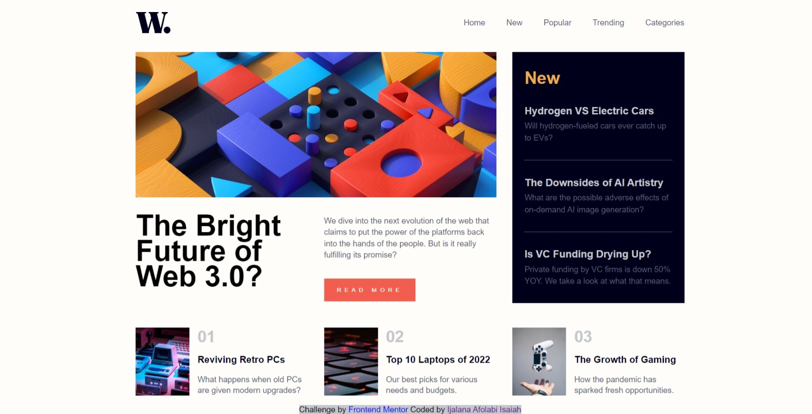

# Frontend Mentor - News homepage solution

This is a solution to the [News homepage challenge on Frontend Mentor](https://www.frontendmentor.io/challenges/news-homepage-H6SWTa1MFl). Frontend Mentor challenges help you improve your coding skills by building realistic projects. 

## Table of contents

- [Overview](#overview)
  - [The challenge](#the-challenge)
  - [Screenshot](#screenshot)
  - [Links](#links)
- [My process](#my-process)
  - [Built with](#built-with)
  - [What I learned](#what-i-learned)
  - [Continued development](#continued-development)
  - [Useful resources](#useful-resources)
- [Author](#author)

## Overview

### The challenge

Users should be able to:

- View the optimal layout for the interface depending on their device's screen size
- See hover and focus states for all interactive elements on the page

### Screenshot



### Links

- Solution URL: (https://github.com/Ayolan8/news-homepage.git)
- Live Site URL: (http://ayolan8.github.io/news-homepage/)

## My process

### Built with

- Semantic HTML5 markup
- CSS custom properties
- CSS Grid
- CSS Flexbox
- Desktop-first workflow

### What I learned

In this project, I had the opportunity to deepen my understanding of CSS Grid. As a programmer, I delved into the intricacies of this powerful layout system, unlocking its potential for creating flexible and responsive designs.

Key Learnings:

CSS Grid Basics:
- I grasped the fundamental concepts of CSS Grid, including grid containers and grid items.
- Understanding the grid-template-columns and grid-template-rows properties allowed me to define the grid structure.

Two-Dimensional Layouts:
- CSS Grid shines when it comes to creating two-dimensional layouts. I explored how to arrange elements both horizontally and vertically.
- By utilizing the grid-column and grid-row properties, I positioned items precisely within the grid.

Responsive Design:
- Leveraging media queries, I adapted my grid layouts to different screen sizes. This flexibility is crucial for building responsive web applications.

Grid Areas and Naming:
- I discovered the power of defining named grid areas using grid-template-areas. This approach simplifies layout management.
- Naming grid areas allowed me to create complex, visually appealing designs with ease.

Takeaways:
- Practice Makes Perfect: Working hands-on with CSS Grid solidified my skills. I encourage fellow developers to experiment and build their own grid-based layouts.
- Documentation Is Your Friend: Referencing official documentation and tutorials helped me overcome challenges and deepen my knowledge.
By the end of this project, I felt confident in my ability to wield CSS Grid effectively. Whether it’s a simple card layout or a complex dashboard, I now have a powerful tool in my web development arsenal.

Below are some of the code snippets from the project:

```html
<div class="item3">
            <div class="footer-img">
                
                <div>
                    <h1>01</h1>
                    <a href="#"><h3>Reviving Retro PCs</h3></a>
                    <p>What happens when old PCs are given modern upgrades?</p>
                </div>
            </div>
    
            <div class="footer-img">
                
                <div>
                    <h1>02</h1>
                    <a href="#"><h3>Top 10 Laptops of 2022</h3></a>
                    <p>Our best picks for various needs and budgets.</p>
                </div>
            </div>
    
            <div class="footer-img">
                
                <div>
                    <h1> 03</h1>
                    <a href="#"><h3>The Growth of Gaming</h3></a>
                    <p>How the pandemic has sparked fresh opportunities.</p>
                </div>
            </div>
        </div>
```
```css
.footer-img > div{
    display: flex;
    flex-direction: column;
    justify-content: space-between;
}

main{
    display: grid;
    grid-template-columns: repeat(3, 320px); 
    grid-column-gap: 2em;
    grid-row-gap: 3em;
}
```
```js
const openMenuIcon = document.getElementById("open-menu");
const closeMenuIcon = document.getElementById("close-menu");
const nav = document.querySelector('nav');
const body = document.body;
let isModalOpen = false;

const openOrCloseSideBar = () =>{
    isModalOpen = !isModalOpen;
    
    if (isModalOpen){
        nav.style.display = "flex";
        nav.classList.add('fixed');
        body.classList.add('transparent-bg');
    }else{
        nav.style.display = "none";
        nav.classList.remove('fixed')
        body.classList.remove('transparent-bg');
    }
    openMenuIcon.classList.toggle("hidden-on-mobile");
    closeMenuIcon.classList.toggle("hidden-on-mobile");
}

openMenuIcon.addEventListener("click", openOrCloseSideBar);
closeMenuIcon.addEventListener("click", openOrCloseSideBar);
```

### Continued development

After exploring the capabilities of CSS Grid, I’ve realized its immense potential for creating sophisticated layouts. Now, I’m determined to hone my craft and become as proficient with CSS Grid as I am with Flexbox.

My Commitment:
Deep Dive into CSS Grid:
- I’ll invest time in understanding the intricacies of CSS Grid.
- Mastering grid containers, grid items, and the various properties will be my priority.

Two Layout Powerhouses:
- While I’m comfortable with Flexbox, I want to achieve the same level of confidence with CSS Grid.
- Flexbox served me well for one-dimensional layouts; now it’s time to embrace the versatility of two-dimensional designs.

Practice and Exploration:
- I’ll build real-world projects using CSS Grid.
- Experimentation, trial, and error will be my companions as I refine my skills.

The Goal:
To seamlessly switch between Flexbox and CSS Grid, creating stunning, responsive web interfaces that leave a lasting impression.

### Useful resources

- [CSS Grid Layout Crash Course, Traversy Media](Youtube.com) - I combine with the material I read on W3schools, and everything clicked.
- [CSS Grid, W3schools](https://www.w3schools.com/css/css_grid.asp) - This is an amazing material which helped me finally understand CSS Grid. I'd recommend it to anyone still learning this concept.

## Author

- Frontend Mentor - [@Ayolan8](https://www.frontendmentor.io/profile/Ayolan8)
- Twitter - [@IsaiahAyodeji1](https://twitter.com/IsaiahAyodeji1)

